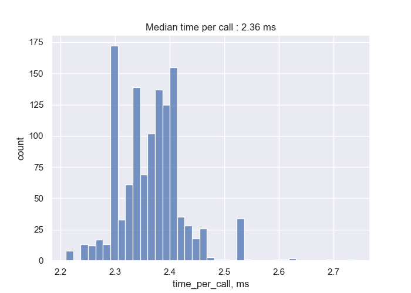
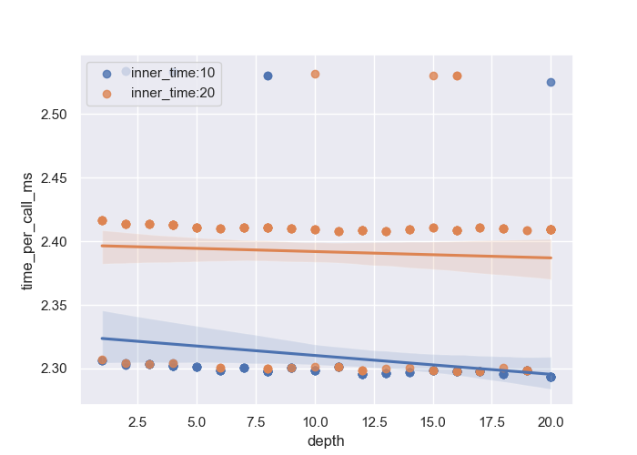
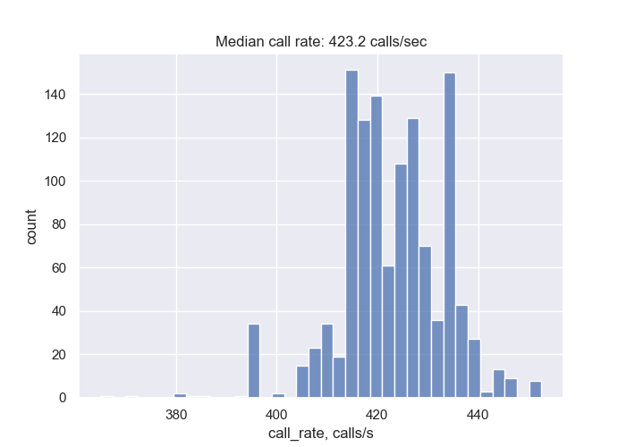
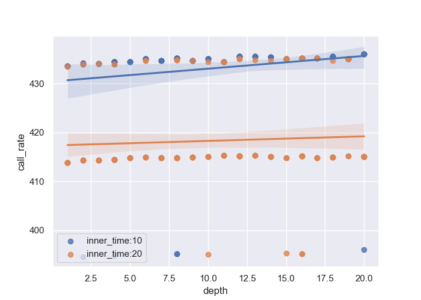
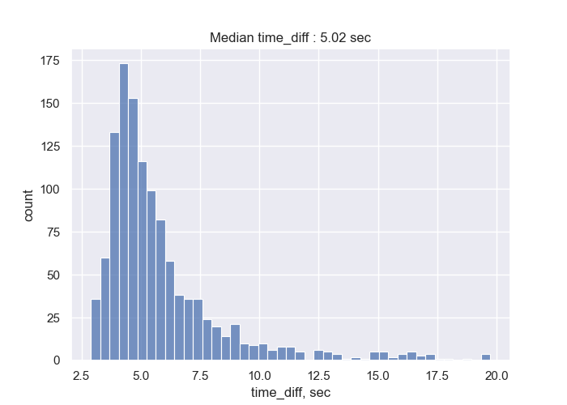
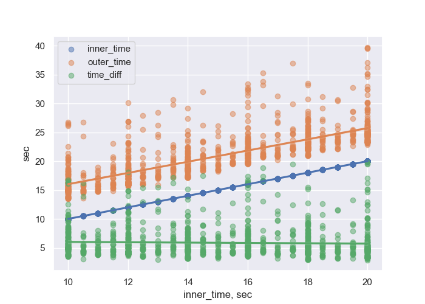

# Inter-Canister Call Overhead

What
- Calculate overhead for using Inter-Canister Call (ICC) on the Internet Computer

Why
- Helps to decide on single- vs multi- canister architecture

How
- Call a chain of canisters with various `depth` in a loop
  - The last canister in the chain does a no-op operation, eg. 1+1
  - Measure `outer_time` –- time outside of `dfx` call
  - Measure `inner_time` –- time inside the [top level canister](./src/canister_0/main.mo)
  - Measure `iterations` of the loop
  - Calculate `time_diff` –- inner/outer time difference
  - Calculate `time_per_call_ms` -- time per ICC
    - `time_per_call = inner_time / (iterations * depth)`
  - Calculate `call_rate` -- ICC rate per sec
- Measure on a testnet
- Assuming finalization rate at 1 ops/s it does not make sense to run experiment with
  - `inner_time < 10 sec`, error >10%
  - `inner_time > 20 sec`, too slow

## Summary

- Maximal inter-canister call depth: 20
- Median time per inter-canister call: ~2.36 ms
- Median inter-canister call rate: ~423 calls/s
- Median inner/outer time difference: ~5.02 sec
  - `time_diff` is constant accros `inner_time` values

## Notes

- More numbers and charts at [Analysis ipython notebook](./analysis.ipynb)
- Run experiment with [run_exp.sh](./run_exp.sh), adjust input values before the run

### Issues

- Sometimes `dfx` hands for way too long, use `gtimeout Xs` to cut execution after a timeout

## Links

- [Make inter-canister calls](https://internetcomputer.org/docs/current/developer-docs/build/backend/intercanister-calls/)
- [Analysis ipython notebook](./analysis.ipynb)